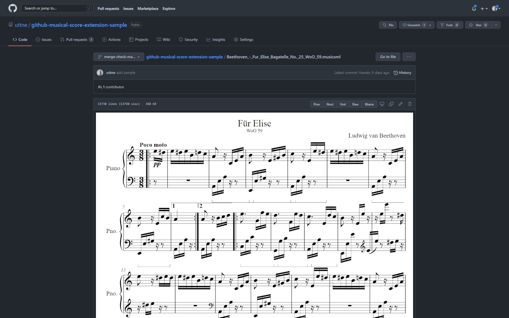

# GitHub Musical Score Extension

GitHub にアップロードした MusicXML を画像で表示する拡張機能。



## インストール

以下の Chrome ウェブストアにアクセスしてインストールしてください。

https://chrome.google.com/webstore/detail/github-musical-score-exte/bkkbicciaifjlkkjojdpkncmohlfokeh?hl=ja

## 開発

以下のスクリプトを実行してライブラリを取得してください。

```powershell
.\fetch-lib.ps1
```
